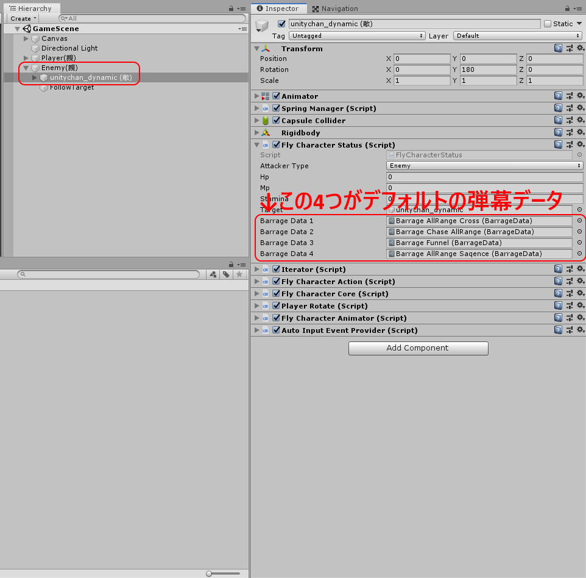
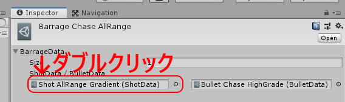
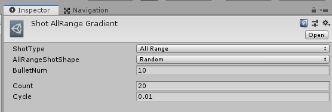

## Enemyの弾幕を変更する
デフォルトでEnemyの使用する弾幕は周囲にばら撒くものが設定されているため、弾の数も多く処理が重くなりやすい。 
そこで敵の使用する弾幕を薄いものに変更することにする。

#### 方法１
現在使用している弾幕のパラメータを変更する方法。 
現在敵が使用している弾幕のデータは`Enemy(親)/unitychan_dynamic(敵)`にアタッチされている `FlyCharacterStatus`が保持しており、この弾幕データをダブルクリックするとそのデータをInspecter上に表示できる。このデータはShotDataクラスとBulletDataクラスの二つからなるクラスである。（詳しくは[リンク先](https://github.com/kotuakoutyan/3DBarrageMaker/blob/master/Documents/HowToUse.md)） 

例えば、２つ目の `Barrage Chase AllRange` を開くと以下のような画面に切り替わる。弾の数を変更したい場合はShotDataを変更する必要があるので、同様にダブルクリックでShotDataを開く。 

すると、以下のような画面が出てくるので、そこで 

- BulletNum（１サイクルに発射する弾数）
- Count（サイクルの数）

の数を変更する。（他のパラメーダの説明は[リンク先](https://github.com/kotuakoutyan/3DBarrageMaker/blob/master/Documents/Shot.md)）

#### 方法２
[この手順](https://github.com/kotuakoutyan/3DBarrageMaker/blob/master/Documents/HowToUse.md)に従って、自分で弾幕を作成する。
