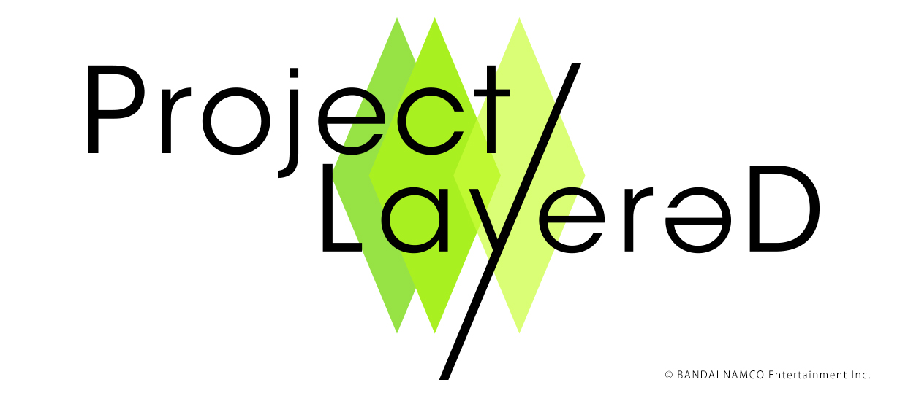

# Unity_STG_Tutorial
キャラコンとSTGの簡単なサンプル

## 本コンテンツの趣旨
以下が本コンテンツの趣旨になっています。それ以外に関しては、見たい人だけどうぞ。

- [Aim Controller](./Assets/Scripts/AimCamera/AimController.cs)
- [PlayerRotate](./Assets/Scripts/AimCamera/PlayerRotate.cs)
- [PlayerController](./Assets/Scripts/SimplePlayer/PlayerController.cs)
- [DisposableBullet](./Assets/Scripts/SimplePlayer/DisposableBUllet.cs)

## 処理が重たい場合
- [PostProseccingを無効にする]()
- [敵の使用する弾幕を薄くする]()

## 権利表記
本制作では以下を使用しています。

### UniRx
The MIT License (MIT)  
Copyright (c) 2018 Yoshifumi Kawai 
https://raw.githubusercontent.com/neuecc/UniRx/master/LICENSE

### ユニティちゃん
© Unity Technologies Japan/UCL  
http://unity-chan.com/contents/license_jp/

### Dotween
Copyright (c) 2014 Daniele Giardini - Demigiant  
http://dotween.demigiant.com/license.php

### Project LayereD
  
https://projectlayered.com/sp/opensource/
